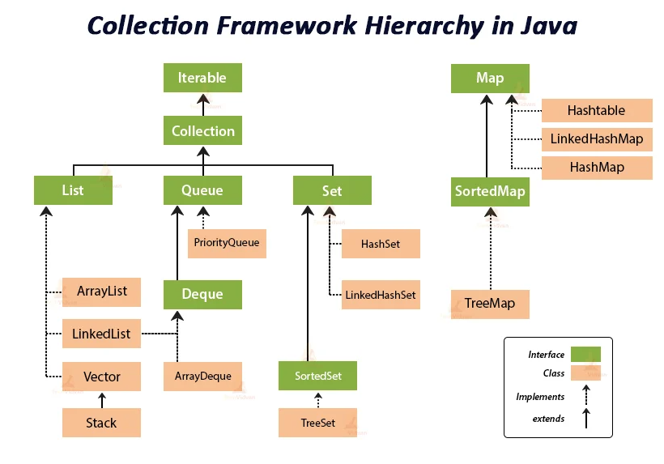

# Java/Spring 面試體集合

# Java

## 簡易

### 請描述JVM, JDK, JRE區別

==**答案**==

- **JVM**
Java虛擬機(Java Virtual Machine), 針對不同的作業系統有各別的實現，可以產出相同的位元組碼(ByteCode)，而這樣的特性造就了Write Once, Run Anywhere。

- **JRE**
Java Runtime Environment，提供可以運行Java程式的平台。內容包含JVM，Java的二進制執行檔，但並沒有提供相關的開發工具。

- **JDK**
Java Development Kit，JRE有的他都有，但又加上了Java編譯器，Java debugger，JShell(JDK9才加入)等其他工具讓開發者可以開發、除錯與執行Java程式。

### 呈上題，我是否可以再正式環境只安裝JRE，不安裝JDK

==**答案**==

看情況，如果只是運行編譯好的Java檔案，那是沒問題的。但如果需要再正式環境上進行編譯或其他修改，則需要JDK。

### Overload與Override是甚麼，區別在哪？

==**答案**==

**Overload(多載)**，是指在**同一`Class`內有同名方法但參數的個數、型態不同**，但要==注意僅只有參數不同，整個方法簽名(Method Signature)改變不一定能稱為Overload==。請參考以下範例：

- 原有方法
```java
public void show(String message) {
    System.out.println(message);
}
```

- Overload - 參數個數不一
```java
public void show(String message, boolean show) {
    System.out.println(message);
}
```

- Overload - 參數型態不一致
```java
public void show(Integer message) {
    System.out.println(message);
}
```

- 非Overload - 改變回傳參數
```java
public boolean show(String message) {
    System.out.println(message);
    return false;
}
```

**Override(覆寫)**，是指在**有繼承關係的`Class`內方法簽名(Method Signature)一致的同名方法**，請參考以下範例：

```java
public class Animal {
    public void say(String message) {
        System.out.println(message);
    }
}

// 方法簽名一樣但是在不一樣的繼承類別
class Dog extends Animal {
    @Override
    public void say(String message) {
        System.out.println("I'm dog, bark!");
    }
}
```
運行看看...
```java
public class App {
    public static void main( String[] args ) {
        Animal animal = new Dog();
        animal.say("I'm unknown animal");
    }
}
```

```
Output:
I'm dog, bark!
```

註：@Override可以不加，依然可以編譯通過並執行。但加了有兩個好處：
1. 編譯器會幫你檢查Overriding的方法是否與父類別的簽名保持一致，避免出錯。
2. 對於人類來讀程式碼的時候，會比較好理解。


Overload與Override都是**Java實現多型的方法**。具體差異如下：

| Overriding      | Overloading   |
|-----------------|---------------|
| 執行時期多型          | 編譯時期多型        |
| 執行時期決定哪個方法應該被呼叫 | 編譯時期就決定呼叫哪個方法 |
| 存在與父子類別         | 存在於同一類別       |
| 以一樣的方法簽名        | 只有方法名字一樣，參數不同 |
|  出錯時，只有執行時期看的見  | 出錯可以在編譯時期就看見  |


### ++i與i++的差異

這題問的是`Increment/Decerment Operator`的執行順序

==**答案**==

`++/--`在前面(prefix)的時候，會**先執行運算**再將變數回傳，而在後面(postfix)的時候，會**先回傳變數後再執行運算**，請參考以下範例：

```java
public class App {
    public static void main(String[] args) {
        int var1 = 5, var2 = 5;

        // 5 先回傳之後才會加到6
        System.out.println(var1++);

        // 先加到6後再回傳
        System.out.println(++var2);
    }
}
```

### `==`與`equals()`區別

==**答案**==

`==`與`equals()`都是用來比對物件是否相同，但這裡面有些微妙的差異。

`==`通常比對的是再Heap裡面的的物件記憶體位置是否相同，而當我們用`new`產生新物件時也會指派新的記憶體位置給新物件，這時用`==`比對就顯得不合適。

所以當我們需要對物件內容進行比對時，便可以覆寫`equals()`方法定義物件內容是否相同。請參考以下範例：

```java
public class Robot {

    private int serialNo;

    public Robot(int serialNo) {
        this.serialNo = serialNo;
    }

    @Override
    public boolean equals(Object o) {
        if (this == o) return true;
        if (o == null || getClass() != o.getClass()) return false;

        Robot robot = (Robot) o;

        return serialNo == robot.serialNo;
    }

}
```
```java
public class App {
    public static void main(String[] args) {
        Robot robot1 = new Robot(1);
        Robot robot2 = new Robot(1);
        System.out.println(robot1 == robot2);
        System.out.println(robot1.equals(robot2));
    }
}
```
運行結果：
```
Output
false
true
```

### 自動拆/裝箱是甚麼？

==**答案**==

自Java 1.5後提供的新功能，提供基本型態(Primitive)自動裝箱(autoboxing)、拆箱(unboxing)，簡單來說就是直接將原始型別升級成相對應的物件進行操作。包裹類型

```
public class App {
    public static void main(String[] args) {
        // Java 5 以前需要自己使用new去包裝
        Integer integerBefore5 = new Integer(10);
        // 現在宣告為包裹類型之後Java會直接幫我們包裝
        Integer integerAfter5 = 10;
    }
}
```

| 基本型態    | 包裹類別      |
|---------|-----------|
| byte    | Byte      |
| short   | Short     |
| int     | Integer   |
| long    | Long      |
| float   | Float     |
| double  | Double    |
| boolean | Boolean   |
| char    | Character |

### 承上題，包裹型態對上基本型別有甚麼好處？

==**答案**==

1. Java幾乎所有的東西都是物件，因此調用方法所需的參數也須是物件，在這時候基本型別便不能傳入，需要包裝承包裹型態後傳入。
2. 包裹型別本身提供比基本型別更多的操作方法，使用上更為方便。

### 為什麼不建議用`float/double`進行精確運算

主要是因為IEEE 754的標準，讓浮點數計算不精確。

```java
public class App {
    public static void main(String[] args) {
        // 算錢用浮點，遲早被人扁
        double a = 0.1f;
        double b = 0.2f;
        System.out.println(a+b);
    }
}
```

```
Output
0.30000000447034836
```

### 承上題，Java對於高精度運算有現成的方案嗎？

==**答案**==

`BigDecimal`

### List、Set、Map區別？

==**答案**==

|          | List                    | Set                                   | Map                                                                |
|----------|-------------------------|---------------------------------------|--------------------------------------------------------------------|
| 重複物件     | 可以                      | 不可以                                   | 不可以                                                                |
| 順序       | 依照插入順序                  | 沒有順序                                  | 沒有順序                                                               |
| Nullable | 可以加入Null                | Null只能有一個                             | Key只能有一個，但Value可以多個Null                                             |
| 實現       | Array List, LinkedList. | HashSet, LinkedHashSet, and TreeSet.  | HashMap, HashTable, TreeMap, ConcurrentHashMap, and LinkedHashMap. |
| 用途       | 需要常用index存取             | 需要物件是唯一的                              | 需要鍵值隊的時候                                                           |

### Collection 和 Collections的區別?

- Collection
` java.util.package`的interface，實作類別有List, Queue, Set



- Collections
Collection的Helper Class，提供有關於搜索，排序，多執行續加鎖的靜態方法\

### Private，Public，Protected，Default差別

主要是在問Access Modifier權限修飾子的差別，以其他語言來說就是Scope的概念，這些物件與方法的可視範圍。在Java中有三個可以顯式寫出的Modifier: `public`, `protected`, `private`，而`Default`則是不寫。這些修飾子可以用在類別，成員變數，方法與構造器上面。

宣告類別時沒有加上任何存取修飾， 則預設為package存取範圍(`Default`)。而類別的宣告比方法宣告來的小的話，則會被受到類別的約束，如以下範例：

```
class Some {
    public int data;
}
```

`Some`沒有特別宣告則為Default，而有一成員變數`data`宣告成`public`，則`data`受到`Some`的修飾子影響變成`Default`

==**答案**==

| 權限修飾子       | 在同一Class | 在同一Package | 不同Package但是子類別繼承 | 不同Package |
|-------------|----------|------------|------------------|-----------|
| Private     | Y        | N          | N                | N         |
| Default(不寫) | Y        | Y          | N                | N         |
| Protected   | Y        | Y          | Y                | N         |
| Public      | Y        | Y          | Y                | Y         |


## 中等

### 成員變數(Field，或是Member Variable)，與區域變數(Local Variable)有何不同？

### HashMap和HashTable的區別?

### 說明stack跟heap？

## 困難

# Spring

## 簡易

### 對於Spring的IoC與DI的理解

**Inversion of Control**，控制反轉，只對於Object的控制權轉給Spring，由Spring負責Object的生命週期(創建與銷毀Object)，以及控制Object之間的Dependency。
    
==**簡單來說，不用自己new Object()了**==

**Dependency Injection**，依賴注入，一種IoC的實現，上述的控制Object之間的Dependency，藉由建構子(Constructor)/Setter/服務查找來傳入對應的Object。

### 甚麼是AOP

**Aspect Oriented Programming**，面向切面編程。對於Procedure/Object Oriented Programming是直向的流程與關係，對於橫向的功能實現對造成相當大的程式碼重複。(像是要在某些特定的方法進入時留下Log，針對方法的效能偵測這種橫向流程)，可以想像是Servlet中的Filter。

### @Component, @Controller, @Repository​​, @Service的理解

在Spring啟動時會依照`classpath`去自動偵測有這些`Annotation`的`Class`並註冊進`ApplicationContext`後接管，大致上分為以下差別

- **@Component** 一個普通Spring接管的Component
- **@Service** 主要是用在MVC架構中的Service Layer，只有語意化的用途(給人類辨識的)，對於Spring來說跟 **@Component** 差不多
- **@Repository** 主要用於持久層，功用是會catch來自持久化相關的Exception，並且轉換成Spring定義的非受檢例外。

註：其實 **@Service** 跟 **@Repository** 底層還是 **@Component**。

```java
// Spring Source Code
@Component
    public @interface Service {
}

@Component
    public @interface Repository {
}
```

- **@Controller** 由==SpringMVC提供(非Spring)==，以經典MVC架構設計，主要提供以下幾點功能
    - 攔截外來的Request
    - 轉換Request payload成內部可用資料結構
    - 資料向後傳送(以Spring為例，送往Service Layer)
    - 將處裡好的資料往前送(可能是JSP, Thymeleaf，或是前後端分離的Vue, React, Angular)

## 中等

## 困難