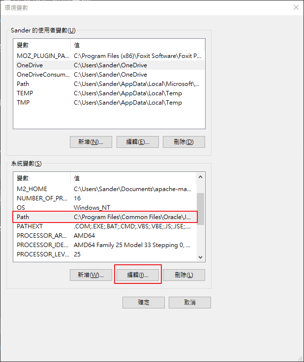

# 環境架設

## Java

==**注意：因公司使用問題，本釋例為AdoptOpenJDK 8**==

### 下載Java並安裝

1. 點擊連結 [https://adoptium.net/temurin/releases/?version=8](https://adoptium.net/temurin/releases/?version=8)


2. 下載後開啟


3. 確認安裝成功

   1. 開啟CMD
   2. 輸入`java -version`與`javac`，看到以下訊息便表示安裝成功
   

## Maven

### 下載Maven並且解壓縮


選定一個資料夾解壓縮，==請記住路徑==

### 設定Maven Home

1. 

2. 

3. 

4. 

5.

6. 

7. 


以上便設定完成。

### 確認安裝成功

1. 開啟CMD
2. 輸入`mvn -v`，看到以下訊息便表示安裝成功


# 基礎語法

## 第一個程式

```java
public class App {
    public static void main(String[] args) {
        System.out.println("Hello World!");
    }
}
```

### 定義類別

> *撰寫 Java 程式通常都是由定義「類別」開始，"class" 是 Java 用來定義類別的關鍵字，範例中類別的名稱是 App，這與您編輯的檔案（App.java）主檔名必須相同，App 類別使用關鍵字 "public" 宣告。*
> 
> *在編寫 Java 程式時，**一個檔案中可撰寫數個類別，但是只能有一個公開（public）類別，而且檔案主檔名必須與這個公開類別的名稱相同**，在定義類別名稱時，建議將類別首字母大寫，並在類別名稱上表明類別的作用。*
>
> *Java SE 6 技術手冊，[第一個Java程式](https://github.com/JustinSDK/JavaSE6Tutorial/blob/master/docs/CH03.md#31-%E7%AC%AC%E4%B8%80%E5%80%8B-java-%E7%A8%8B%E5%BC%8F)*

### main()方法解說

main() 是 Java 程式的「進入點」（Entry point），程式的執行是由進入點開始的。

- public：表示此方法可以被外部呼叫。
- static: Main方法不需要實例化物件便可執行
- void：主方法是程式的起點，所以不需要任何的返回值。
- main: 系統規定好預設呼叫的方法名稱，執行時預設找到main方法名稱。

### System.out.print

這裡不琢磨太多IO相關的問題，簡單來講就是調用了System類別中的out去把文字輸出。

### 註解

跟大部分語言一樣，語法為`//`，或是`/* */`，要注意的是`/** */`為Javadoc，生成Java手冊用的工具，可以再查API的時候看到。

```java
public class App {
    public static void main(String[] args) {

        // This is comment
        /*
         * Hello world!
         */
        /** 
         * This is javadoc
         * @authoer  Sander Chen
         */
        System.out.println("Hello World!");
    }
}
```

## 基礎資料型態與運算子

### 基礎資料型態(Primitive Type)


```
short 	數值範圍：32767 ~ -32768
int 	數值範圍：2147483647 ~ -2147483648
long 	數值範圍：9223372036854775807 ~ -9223372036854775808
byte 	數值範圍：127 ~ -128
float 	數值範圍：3.402823e+38 ~ 1.401298e-45
double 	數值範圍：1.797693e+308 ~ 4.900000e-324
```

### 運算子

- 算數運算子


- 邏輯運算子


- 比較運算子


## 流程控制

請參考FlowControl.java

# 物件基礎

## 定義類別 Define Class


### 類別宣告 The Class Declaration

第一行內我們可以分為幾個部分：


1. 權限修飾子 `非必須`

定義這個Class的Scope(可視範圍)，要注意與Field(成員變數)與Method的差別是沒有`protected`

至於為什麼沒有可以[參考這篇stackoverflow](https://stackoverflow.com/questions/3869556/why-can-a-class-not-be-defined-as-protected)

| 限修飾子        | 在同一Class | 在同一Package | 不同Package  |
|-------------|----------|------------|------------|
| Private     | Y        | N          | N          |
| Default(不寫) | Y        | Y          | N          |
| Public      | Y        | Y          | Y          |

2. `abstract` 抽象 `非必須`

這個關鍵字用在宣告Class的時候，這個Class便不能被實例化(instantiate)。

==簡單講，就是無法用`new`去產生物件。==

3. `final` `非必須`

這個關鍵字用在宣告Class的時候，這個Class便不能被繼承。

==簡單講，就是無法有子類別。==

題外話，`final`如果再成員變數上使用的話跟`javascript`的`const`很像，不能重複`assign value`

4. `class {NameOfClass}` ==必須==

`class`關鍵字讓`compiler`知道你要定義的是類別，`{NameOfClass}`則是定義類別的名稱，規則之前有提到：==**在定義類別名稱時，建議將類別首字母大寫**==

5. `extends {SuperClass}` `非必須`

`extends`關鍵字代表繼承，被繼承者須為類別，這個我們之後會提到。這邊只要注意的是 ==**Java繼承只能使用一次(單一繼承)，與C++多重繼承不同。**==

6. `implements {Interface}` `非必須`

`implements`關鍵字代表實作，被實作者須為介面，依樣之後會提到，這邊只要注意的是 ==**Java可以無限實作介面，與繼承只能一次不同**==


### 類別體

由`{}`包覆，裡面會有包含以下幾個元素：

- 變數

主要有以下兩種

1. 成員變數
2. 類別變數

- 方法

1. 成員方法
2. 類別方法
3. 有個特別的 **==類別同名方法==**，我們稱為 **==建構子(`constructor`)==**

我們先從變數與宣告講起：

#### 變數與宣告 Declaring Variables


```java
private Vector items;
```

而宣告變數中也有幾個元素可以參考


1. 權限修飾子(access level) `非必須`
我們剛剛有提到類別的權限修飾子，而變數也有，這時候要注意多了一個`protected`。

| 權限修飾子       | 在同一Class | 在同一Package | 不同Package但是子類別繼承 | 不同Package |
|-------------|----------|------------|------------------|-----------|
| Private     | Y        | N          | N                | N         |
| Default(不寫) | Y        | Y          | N                | N         |
| Protected   | Y        | Y          | Y                | N         |
| Public      | Y        | Y          | Y                | Y         |

2. `static` `非必須`
加上了static之後就變成了`類別變數`，成員變數必須實例化之後才會被創造，個別實體的成員變數是獨立的。而類別變數則是共享的且無須等類別被實例化，所有實體都可以分享該類別變數。

3. `final` `非必須`
與類別的不能繼承不同，這裡指的是變數不能被re-assign value(類似`js const`)

4. `transient` `非必須`
**==很少用==** ，通常是用在序列化`Object Serialization`用，但Java現在已經很少再用甚至不被推薦使用，有興趣可以參考我之前寫的[我在想甚麼時候該用Serializable](https://blog.sanderxavalon.com/archives/when-to-use-serializable)

5. `volatile` `非必須`
**==進階Java才會用到==**，主要是解決多執行續的相關問題，這議題不再這個光速講義的範圍裡面。

6. `{type}` ==必須==
型別，可以是基礎型別`primitive type`像是`short`, `int`...，或是類別型態(`Class type`)像是`String`等等。

7. `{name}` ==必須==
參數名，只要是legal Java identifier 都可以。約定成俗的命名方式是 **==開頭小寫==**

#### 方法 Method

分為兩個副分，`方法宣告method declaration`與`方法體method body`


##### 方法宣告method declaration


1. 權限修飾子(access level) `非必須`
跟宣告變數的一樣，一樣注意多了一個`protected`。

| 權限修飾子       | 在同一Class | 在同一Package | 不同Package但是子類別繼承 | 不同Package |
|-------------|----------|------------|------------------|-----------|
| Private     | Y        | N          | N                | N         |
| Default(不寫) | Y        | Y          | N                | N         |
| Protected   | Y        | Y          | Y                | N         |
| Public      | Y        | Y          | Y                | Y         |

2. `static` `非必須`
加上了static之後就變成了`類別方法`，跟變數一樣，宣告了之後所有實體皆可調用。

3. `abstract` `非必須`

這裡的抽象與類別的`abstract`相呼應，寫上之後便不用寫方法體，留給繼承的子類別去implement。

4. `final` `非必須`

寫上之後繼承的子類別不能覆寫(Override)。

5. `native` `非必須`

通常用於調用其他語言的方法，不在此討論。

6. `synchronized` `非必須`

通常用於多執行序加鎖，不在此討論。

7. `returnType` ==必須==

回傳類型，可以是基礎型別`primitive type`或是複雜型別，如果不回傳則需使用`void`關鍵字。

8. `{methodName}` ==必須==
方法名，只要是legal Java identifier 都可以，取名時要小心`Overload`問題

9. `(paramlist)` ==必須==
傳入參數，如果不傳入參數則寫上`()`

10. `[throws exceptions]`  `非必須`
需要顯式寫出拋出受檢例外`checked exception`時須加上，這個等到`Exception`篇章再詳細討論

##### 方法體method body

這裡有幾個重點要提：

1. `this`

通常用來給人類看，避免造成誤會，譬如成員變數與方法參數同名時，可以用`this`來表達該實體的參數，請參照以下範例：

```
class HSBColor {
    int hue, saturation, brightness;
    HSBColor (int hue, int saturation, int brightness) {
        this.hue = hue;
        this.saturation = saturation;
        this.brightness = brightness;
    }
}
```

2. 區域變數 

如同其他語言一樣，方法結束則變數消失。

```java
Object findObjectInArray(Object o, Object[] arrayOfObjects) {
    //方法結束後i則消失
    int i;      // local variable
    for (i = 0; i < arrayOfObjects.length; i++) {
        if (arrayOfObjects[i] == o)
            return o;
    }
    return null;
}
```

==**註：Overload與Override**==

**Overload(多載)**，是指在**同一`Class`內有同名方法但參數的個數、型態不同**，但要==注意僅只有參數不同，整個方法簽名(Method Signature)改變不一定能稱為Overload==。請參考以下範例：

- 原有方法
```java
public void show(String message) {
    System.out.println(message);
}
```

- Overload - 參數個數不一
```java
public void show(String message, boolean show) {
    System.out.println(message);
}
```

- Overload - 參數型態不一致
```java
public void show(Integer message) {
    System.out.println(message);
}
```

- 非Overload - 改變回傳參數
```java
public boolean show(String message) {
    System.out.println(message);
    return false;
}
```

**Override(覆寫)**，是指在**有繼承關係的`Class`內方法簽名(Method Signature)一致的同名方法**，請參考以下範例：

```java
public class Animal {
    public void say(String message) {
        System.out.println(message);
    }
}

// 方法簽名一樣但是在不一樣的繼承類別
class Dog extends Animal {
    @Override
    public void say(String message) {
        System.out.println("I'm dog, bark!");
    }
}
```
運行看看...
```java
public class App {
    public static void main( String[] args ) {
        Animal animal = new Dog();
        animal.say("I'm unknown animal");
    }
}
```

```
Output:
I'm dog, bark!
```

註：@Override可以不加，依然可以編譯通過並執行。但加了有兩個好處：
1. 編譯器會幫你檢查Overriding的方法是否與父類別的簽名保持一致，避免出錯。
2. 對於人類來讀程式碼的時候，會比較好理解。


Overload與Override都是**Java實現多型的方法**。具體差異如下：

| Overriding      | Overloading   |
|-----------------|---------------|
| 執行時期多型          | 編譯時期多型        |
| 執行時期決定哪個方法應該被呼叫 | 編譯時期就決定呼叫哪個方法 |
| 存在與父子類別         | 存在於同一類別       |
| 以一樣的方法簽名        | 只有方法名字一樣，參數不同 |
|  出錯時，只有執行時期看的見  | 出錯可以在編譯時期就看見  |


#### 建構子 Constructor

**==類別同名方法==**，所有Java類別都有建構子去實例化物件。==因Java有Overload(多載)機制，所以建構子可以有多個==。而呼叫時Java會判斷類型與參數數量去決定使用哪個建構子。不過建構子不一定要寫，==如果compiler沒偵測到類別中有顯式寫出建構子的話，會自動提供預設建構子(default constructor)==，但要注意的是裡面的成員類別因為沒有assigned value，所有的成員變數均為預設值(如int = 0, 自定義類別為null)。

而建構子也可以套用權限修飾子。

| 權限修飾子     | 作用                        |
|-----------|---------------------------|
| private   | 誰都不行實例化類別，通常用於Singleto Pattern |
| protected | 只有繼承類別可以實例化               |
| public    | 誰都可以實例化                   |
| default   | 只有同package下的類別可以實例化       |

# Exception

# Collection Framework與Map

# Java 8 Lambda


